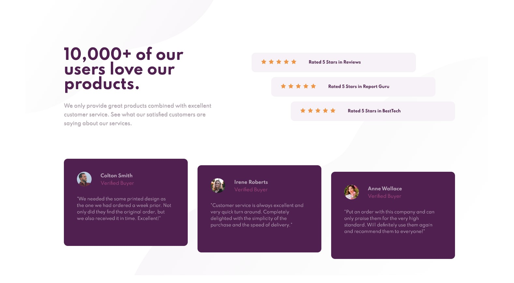

# Frontend Mentor - Social proof section solution

This is a solution to the [Social proof section challenge on Frontend Mentor](https://www.frontendmentor.io/challenges/social-proof-section-6e0qTv_bA). Frontend Mentor challenges help you improve your coding skills by building realistic projects. 

## Table of contents 📝✒️

- [Overview](#overview)
  - [The challenge](#the-challenge)
  - [Screenshot](#screenshot)
  - [Links](#links)
- [My process](#my-process)
  - [Built with](#built-with)
  - [What I learned](#what-i-learned)
- [Author](#author)


## 📇 Overview 📇

### The challenge ✔️

Users should be able to:

- View the optimal layout for the section depending on their device's screen size


### Screenshot 🪟



### Links 🔗

- Solution URL: [GitHub](https://github.com/MartianFlow/challengue-social-proof-section-master)
- Live Site URL: [LiveSite](https://martianflow.github.io/challengue-social-proof-section-master/)

## 🧩 My process 🧩

### Built with  🛠

- Semantic HTML5 markup
- CSS custom properties
- Flexbox
- Mobile-first workflow

### What I learned 🥇

I learned to use:

```css


```

## Author 👽

- Website - [GitHub](https://github.com/MartianFlow)
- Frontend Mentor - [@MartianFlow](https://www.frontendmentor.io/profile/MartianFlow)
- Twitter - [@Martian__Flow](https://twitter.com/Martian__Flow)


#  Have fun building! 🚀